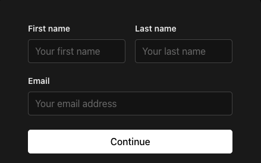

# 整体风格

- 遵循 macOS 原生设计风格
- 使用简洁、轻量的视觉元素
- 采用适当的留白和间距
- 使用 tailwindcss 进行样式设计

# 窗口尺寸
- 建议采用紧凑型设计
- 支持响应式布局

# 首页设计
要求：
- 页面上展示图片的地方先用一个div元素占位，后续我会自己替换成实际图片

## 布局
1，最上面是一个导航栏，左边是一个 logo，右边是一些导航链接：使用介绍和登录
2，下面模块用于介绍浏览器翻译插件，上面是插件的一句话介绍，下方是三个下载按钮：chrome、edge、github，在下面是一个插件的截图。
3，再下面是插件功能的详细介绍，有3-5个模块介绍插件的具体功能。布局是：上面是功能的一句话介绍，下面是功能截图。
功能分别是：
a，选词翻译
b，搜索单词
c，收藏/取消收藏单词同步到 app
d，将单词导出 anki 中
e，背单词
4，最后是常规的网页脚，会放一些友链和备案信息

## 样式
- 顶部和下载样式参考该图片：
- 功能点样式参考该图片：
- 底部样式参考该图片：

# 登录页面
登录框直接在当前页面显示并进行登录，不单独弹出一个页面

## 布局
1，上面一行是手机号码输入框
2，下面一行左边是短信验证码输入框，右边是验证码发送按钮
3，最下面是登录按钮
4，只有登录功能，没有注册、重置密码、记住我等功能

## 样式
- 登录页面样式参考该图片：